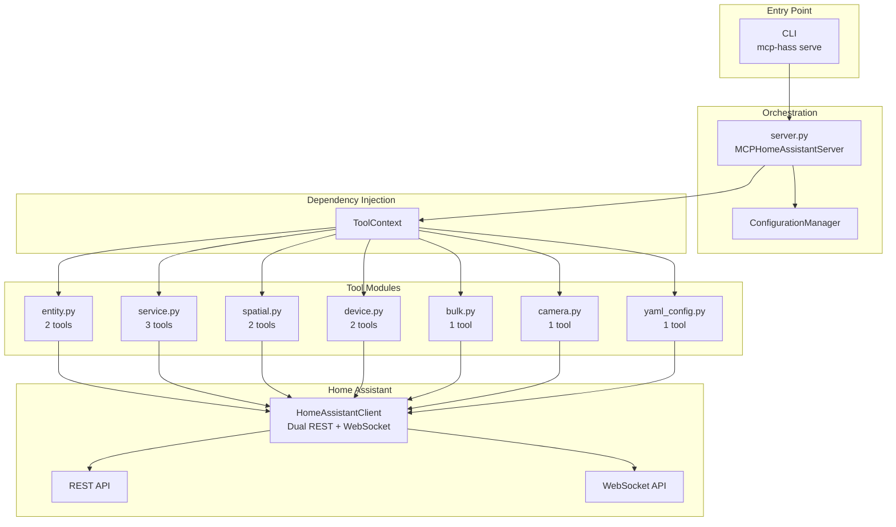
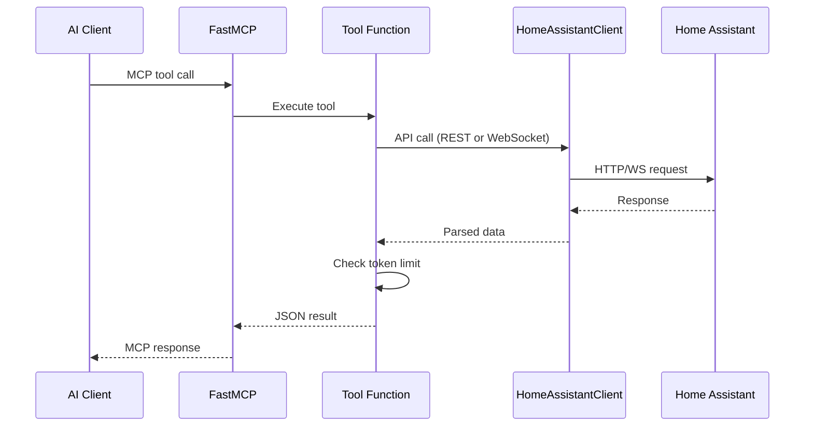

# MCP-HASS

[](https://github.com/max-rousseau/mcp-hass)
[](https://python.org)
[](https://github.com/modelcontextprotocol/python-sdk)

MCP-HASS connects AI assistants to Home Assistant through the Model Context Protocol (MCP). It exposes Home Assistant entities, services, areas, devices, and cameras as MCP tools that any compatible AI client can use to monitor and control a smart home.

## Features

- 10 MCP tools covering entity discovery, service calls, area/device management, camera snapshots, and YAML config reload
- Dual-API client: REST for entity states and service calls, WebSocket for area/device/entity registries
- Self-healing connections with automatic reconnection and retry logic
- Token-aware responses with configurable limits to avoid exceeding LLM context windows
- Two deployment modes: stdio (Claude Desktop) and HTTP (Docker, any MCP client)
- TLS certificate verification toggle for self-signed cert deployments (`HA_SSL_VERIFY`)
- Launch script with MCP Inspector smoke tests for end-to-end validation

## Architecture

Modular dependency-injection architecture built on FastMCP. The server is a thin orchestrator that delegates to focused tool modules via `ToolContext`.





## Usage

### MCP Tools

| Category | Tool | Description |
|----------|------|-------------|
| Entity | `find_entities` | Discover entities with filtering (domain, area, state, attributes) |
| Entity | `get_entity_history` | Historical state data |
| Service | `call_service` | Control devices |
| Service | `call_service_bulk` | Bulk operations across multiple entities |
| Service | `get_services` | List available services |
| Service | `get_service_detail` | Service schema details |
| Spatial | `list_areas` | Get all areas/zones |
| Spatial | `get_area_devices` | Devices in an area |
| Device | `find_devices` | Discover devices with filtering |
| Device | `get_device_entities` | Entities for a device |
| Camera | `get_camera_snapshot` | Capture with intelligent downsampling |
| Config | `reload_yaml_config` | Validate and reload YAML config |

### CLI

```bash
mcp-hass serve                    # Start stdio server (default)
mcp-hass serve --transport http   # Start HTTP server
mcp-hass init                     # Create config file
mcp-hass validate                 # Validate configuration and HA connectivity
mcp-hass tools                    # List registered tools
mcp-hass config                   # Show active configuration
```

## Getting Started

### Prerequisites

- Python 3.10+
- A running Home Assistant instance
- A Home Assistant long-lived access token ([create one here](http://homeassistant.local:8123/profile))

### Option A: stdio (Claude Desktop)

1. Install: `pipx install mcp-hass`
2. Initialize config: `mcp-hass init`
3. Edit `~/.config/mcp-hass/config` with your `HA_BASE_URL` and `HA_TOKEN`
4. Validate: `mcp-hass validate`
5. Add to Claude Desktop config (`~/Library/Application Support/Claude/claude_desktop_config.json`):
   ```json
   {
     "mcpServers": {
       "mcp-hass": {
         "command": "mcp-hass",
         "args": ["serve"]
       }
     }
   }
   ```

### Option B: Docker (HTTP)

1. Configure environment:
   ```bash
   cp .env.example .env
   # Edit .env with HA_BASE_URL, HA_TOKEN, and optionally MCP_HOST_PORT
   ```

2. Launch (builds, starts, and runs smoke tests):
   ```bash
   ./launch.sh
   ```

3. Connect via mcp-remote:
   ```json
   {
     "mcpServers": {
       "mcp-hass": {
         "command": "npx",
         "args": ["mcp-remote", "http://127.0.0.1:3000/mcp"]
       }
     }
   }
   ```
   Adjust the port if you changed `MCP_HOST_PORT` in `.env`.

### Configuration Reference

```env
# Home Assistant (required)
HA_BASE_URL=http://homeassistant.local:8123
HA_TOKEN=your_long_lived_access_token
HA_TIMEOUT=10
WS_RECONNECT_ATTEMPTS=5
HA_SSL_VERIFY=true          # Set to false for self-signed certs

# MCP Server (required)
MCP_SERVER_NAME=MCP-HASS
LOG_LEVEL=INFO
DEBUG_MODE=false

# Docker (optional)
MCP_HOST_PORT=3000          # Host port for Docker compose
```
